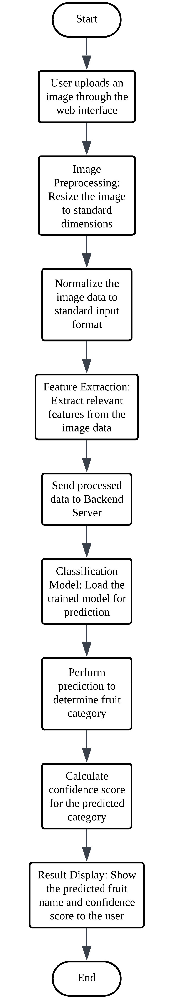
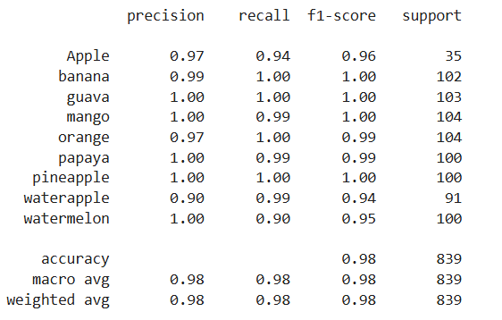

# Fruit Recognition System

A deep learning-based web application that classifies images of fruits with high accuracy using Convolutional Neural Networks (CNN). Built using TensorFlow, Flask, and HTML/CSS, this system serves as an intelligent tool for automated fruit identification and sorting.

---

## Project Overview

This project demonstrates the application of deep learning in computer vision by recognizing and classifying **9 types of fruits** from user-uploaded images. It is designed as an end-to-end web solution integrating model training, backend deployment, and frontend UI.

---

## Objectives

- Build a fruit classification model using **MobileNetV2 (CNN)**
- Preprocess and augment dataset to improve generalization
- Integrate the trained model into a web application using Flask
- Enable multi-image uploads with live predictions and confidence scores
- Achieve and maintain high performance (≈98% accuracy)

---

## Problem Statement

Manual fruit classification in agriculture and retail is slow, error-prone, and labor-intensive. This project aims to **automate fruit recognition** to improve speed, accuracy, and scalability, thereby enhancing productivity and reducing costs in the fruit supply chain.

---

## Technology Stack

| Area            | Tools Used                            |
|-----------------|----------------------------------------|
| Model Training  | TensorFlow, Keras, MobileNetV2         |
| IDEs            | Google Colab, VS Code                  |
| Web Framework   | Flask (Python)                         |
| UI/Frontend     | HTML5, CSS3, Bootstrap                 |
| Dataset         | Kaggle (Custom-split for train/val/test) |
| Deployment      | Localhost (Flask server)               |

---

## System Architecture

1. **Dataset Preparation** – 9 fruit classes, split into train/val/test
2. **Model Training** – MobileNetV2 + Dense layers with Dropout
3. **Model Saving** – Saved in `.h5` format
4. **Flask Integration** – REST API to handle image upload and prediction
5. **Frontend UI** – Stylish image uploader and result display
6. **Output** – Displays predicted fruit and confidence score

---

## Flowchart

<p align="center">
  
</p>

<p align="center">
  <em>Figure: Flowchart</em>
</p>

---

## Results

- **Test Accuracy**: ~98%
- **Precision/Recall**: High across all 9 classes
- **Model Size**: Lightweight due to MobileNetV2
- **Real-time Predictions**: Under 1 second per image

Confusion matrices and training graphs illustrate strong convergence and low misclassification.

<br>

<p align="center">
  
  
</p>

<p align="center">
  <em>Figure: Confusion Matrix and Evaluation Parameters</em>
</p>

<br>

<p align="center">
  
</p>

<p align="center">
  <em>Figure: Accuracy and Loss of Training and validation</em>
</p>

---

## Demo Screenshots

The UI displays predictions with fruit images and confidence levels.

<br>

<p align="center">
  
</p>

<p align="center">
  <em>Figure: Landing Page</em>
</p>

<br>

<p align="center">
  
</p>

<p align="center">
  <em>Figure: Result Displayed in Webpage</em>
</p>

<br>

> For local testing, run `app.py` and navigate to `http://localhost:5000`.

---

## Project Structure

```bash
Fruit_Recognition_System/
│
├── static/ # Uploaded images & background assets
├── templates/ # HTML frontend (index.html, result.html)
├── model/
│ └── fruit_classifier_model.h5
├── app.py # Flask web server
├── train_model.ipynb # CNN training on Google Colab
└── class_labels.json # Mappings of label to fruit name
```

---

## How to Run

```bash
git clone https://github.com/SYam9876/Fruit_Recognition_System.git
cd Fruit_Recognition_System
pip install -r requirements.txt
python app.py
```

---

## Future Enhancements

- Support for real-time webcam detection
- Add more fruit classes and diverse datasets
- Deploy on cloud (Heroku, Render, etc.)
- Mobile app integration (Flutter or Android)

---

## License

This project is intended for academic demonstration and learning purposes. Please contact the authors for further usage or adaptation.

---

## Connect

If you're a recruiter or developer interested in AI, computer vision, or full-stack ML apps — feel free to connect!

Email: syamkrishna.b2@gmail.com
